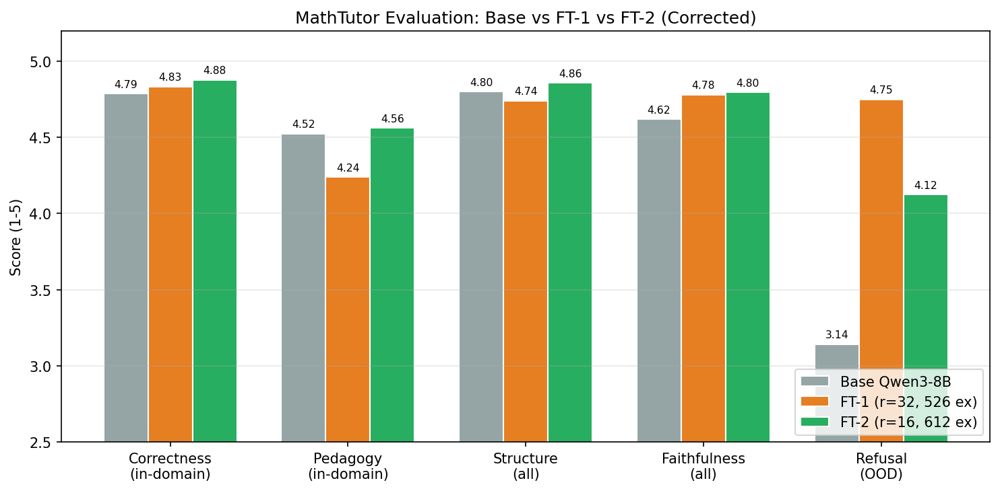
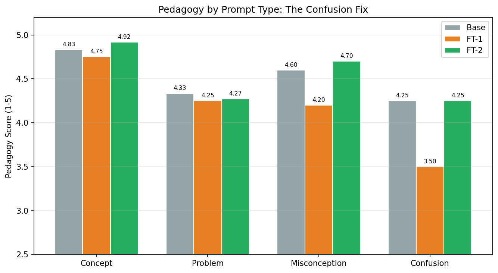
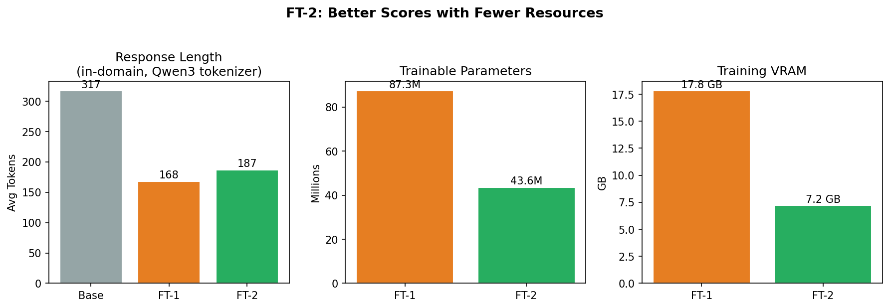

# MathTutor-Qwen3: LLM-as-Judge Evaluation

Evaluation results for [MathTutor-Qwen3-8B-QLoRA](https://huggingface.co/Yash0707/MathTutor-Qwen3-8B-QLoRA), a fine-tuned K-12 math tutor.

## What's here

I used Claude Sonnet 4 to judge both the base Qwen3-8B and my fine-tuned MathTutor on 50 held-out prompts. Each response was scored on its own (single-answer grading, randomized order) across 5 criteria.

I went through two fine-tuning rounds:
- **FT-1** (r=32, 526 examples): good at OOD refusal, but pedagogy actually got worse
- **FT-2** (r=16, 612 examples, NEFTune): fixed the pedagogy problem

## Results (FT-2, Corrected)

| Metric | Base Qwen3-8B | FT-2 MathTutor | Delta |
|---|---|---|---|
| Correctness (in-domain) | 4.79 | **4.88** | +0.09 |
| Pedagogy (in-domain) | 4.52 | **4.56** | +0.04 |
| Structure (all) | 4.80 | **4.86** | +0.06 |
| Faithfulness (all) | 4.62 | **4.80** | +0.18 |
| Refusal (OOD only) | 3.14 | **4.12** | +0.98 |

FT-2 beats base on all 5 metrics.







## Why "corrected"?

While going through the judge's raw JSON, I found that the base model got inflated correctness/pedagogy scores when it went along with OOD requests. For example, when a student asked for Python help, the base model wrote a working bubble sort and the judge gave it correctness=5. That's technically correct code, but a math tutor shouldn't be writing Python at all.

The judge was also inconsistent on refusals: sometimes it scored correctness as N/A, other times as 5 for the exact same kind of response.

I fixed this by splitting metrics by domain:
- Correctness and pedagogy only count on math prompts (42 of them)
- Refusal only counts on OOD prompts (8 of them)
- Structure and faithfulness count on everything

The raw (uncorrected) scores are also in the repo if you want to compare.

## Judge prompt

Full prompt is in [`judge_prompt.md`](judge_prompt.md). In short, the judge scores 5 things on a 1-5 scale:

1. **Correctness** - is the math right?
2. **Pedagogy** - does it actually teach, or just dump the answer?
3. **Structure** - is it organized (Goal/Steps/Example/Checkpoint)?
4. **Faithfulness** - does it make stuff up?
5. **Refusal** (OOD only) - does it redirect off-topic questions back to math?

## Known issues with this eval

- The judge tends to prefer longer responses (verbosity bias)
- This is single-turn only, so it can't measure how the tutor handles a back-and-forth conversation
- No human evaluation (I ran out of time)
- The judge's inconsistency on OOD scoring is why I had to do the correction above

## Repo structure

```
├── judge_prompt.md                          # Exact prompt I sent to Claude
├── results/
│   ├── base_eval_results.json               # Base Qwen3-8B responses (50 prompts)
│   ├── eval_results_v1.json                 # FT-1 responses
│   ├── eval_results_v2.json                 # FT-2 responses
│   ├── llm_judge_results_v1.json            # FT-1 judge scores (raw)
│   ├── llm_judge_results_v1_corrected.json  # FT-1 corrected (domain-scoped)
│   ├── llm_judge_results_v2.json            # FT-2 judge scores (raw)
│   └── llm_judge_results_v2_corrected.json  # FT-2 corrected (domain-scoped)
├── analysis/
│   ├── corrected_scores.py                  # How I computed the corrected scores
│   └── accurate_token_count.py              # Response length comparison using the actual Qwen3 tokenizer
└── README.md
```

## Related links

- [Model on HuggingFace](https://huggingface.co/Yash0707/MathTutor-Qwen3-8B-QLoRA)
- [Dataset on HuggingFace](https://huggingface.co/datasets/Yash0707/mathtutorqwen3-8b-data)
- [Notebook on Colab](https://colab.research.google.com/drive/1cRUTqEyTuUcYJdQ_NxCN4CAtvgjaJK79)
